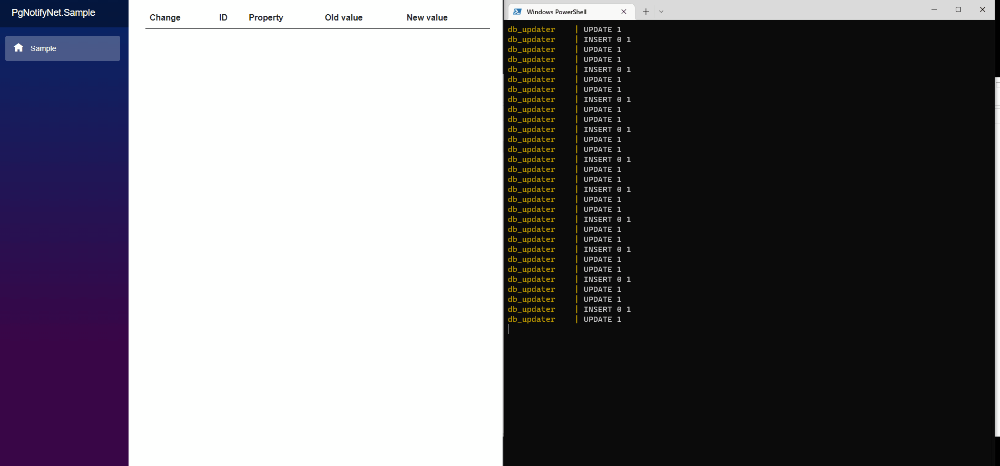

# Blazor + SignalR + pgNotifyNet + PostgresSQL notify/listen sample application

## An implementation of real time notification using SignalR and the PostgreSQL listen/notify feature + PgNotifyNet



```
docker-compose up
````
<pre>
<a href="http://localhost:5111">http://localhost:5111</a>
</pre>


Listen to database changes:
```
builder.Services.AddPgNotifyNet(builder.Configuration.GetConnectionString("SampleDatabase"),
                    c => 
                        c.Trigger(t => 
                            t.OnTable<Category>(table: "categories", schema: "public").After(Change.Update, Change.Insert)));
```

Handle notification from database and publish to clients via SignalR:
```
public class CategoryNotification : IHandleNotification<Category>
{
    private readonly IHubContext<DbNotificationHub> _hubContext;

    public CategoryNotification(IHubContext<DbNotificationHub> hubContext)
    {
        _hubContext = hubContext;
    }

    public Task OnDataChanged(Category oldData, Category newData, Change change)
    {
        _hubContext.Clients.All.SendAsync("onCategoryUpdated", oldData, newData, change);
        return Task.CompletedTask;
    }
}
```

Update client
```
@code{
        hubConnection.On<Category,Category, Change>("onCategoryUpdated", (oldCategory,newCategory,change) =>
        {
            ...
        });
    }
```
